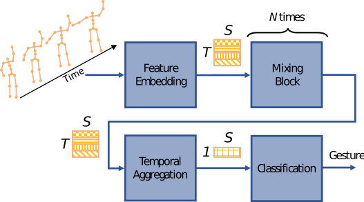

# A Spatio-Temporal Multilayer Perceptron for Gesture Recognition


**[Traffic Control Gesture Recognition for Autonomous Vehicles](https://arxiv.org/abs/2204.11511#)**<br />
This is the official project page of our paper.<br />
Adrian Holzbock*, Alexander Tsaregorodtsev*, Youssef Dawoud, Klaus Dietmayer, Vasileios Belagiannis<br />
Accepted at the 33rd IEEE Intelligent Vehicles Symposium (IV22), June 5th - 9th 2022, Aachen, Germany<br />
*denotes equal contribution<br />
The paper video can be found on [YouTube](https://youtu.be/zaRBoerLA1w).

<div align="center">

</div>

## Requirements

- Tested on Ubuntu 20.04 and Python 3.8.10
- Install the dependencies in [requirements.txt](./requirements.txt) with `pip install -r requirements.txt`

## Dataset download

We use the publicly available Traffic Control Gestures and Act & Drive datasets in our work. For training and testing the models, place the dataset files in the correct directories like shown below.
```shell
temporalmlp
│
└───tcg
│   └───tcg_dataset_2
│       │subj001
│       │...
└───act_and_drive
│   └───activities_3s
│   │   │a_column_co_driver
│   │   │...
│   └───openpose_3d
│   │   │vp1
│   │   │...
│   │calb_data.pkl
│   │...
└───runs
│   │exp_0
│   │...
│README.md
│...
```

#### Traffic Control Gestures dataset

Download the dataset from the official [website](https://github.com/againerju/tcg_recognition) and extract the data into the tcg directory.

#### Drive & Act dataset

Download the data from the official [website](https://driveandact.com/). Use the Activities and the 3D Body Pose annotations. Move the ```activities_3s``` from the Activities and the ```opepose_3d``` from the 3D Body Pose to the act_and_drive directory. Prepare the dataset with the following command:
```shell
cd act_and_drive
python3 prepare_aad.py --data --coarse_label
```

This creates a Python pickle file containing the 3D skeletons (skeletons.pkl) and another containing the corresponding labels (coarse_labels.pkl).


## Training

Verify that you prepared your environment and the datasets in the right manner. To train with standard hyperparameters you can use the run scripts. To reproduce the different baselines, run:
- Train Traffic Control Gestures with the Cross Subject protocol: ```shell ./run_TCG_cs.sh```
- Train Traffic Control Gestures with the Cross View protocol: ```shell ./run_TCG_cv.sh```
- Train Drive & Act: ```shell ./run_aad.sh```

You can adapt the standard hyperparameters in the training by using argparse. To do this, use ```train.py``` and specifiy the new values for the hyperparameters:
```shell
python3 train.py --set_the_parameters
```
For each training a new log file directory ```exp_?``` is created in ```./runs/```. The best models, the results and the hyperparameters will be saved there.

## Evaluation

To test the trained models use ```test.py``` and define the path to the model e.g. ```./runs/exp_0```:
```shell
python3 test.py --data ./runs/exp_?
```


## Citation
If you use stMLP in your work or refer to our results in your paper, please cite the following work:

```latex
@INPROCEEDINGS{9827054,
  author={Holzbock, Adrian and Tsaregorodtsev, Alexander and Dawoud, Youssef and Dietmayer, Klaus and Belagiannis, Vasileios},
  booktitle={2022 IEEE Intelligent Vehicles Symposium (IV)}, 
  title={A Spatio-Temporal Multilayer Perceptron for Gesture Recognition}, 
  year={2022},
  volume={},
  number={},
  pages={1099-1106},
  doi={10.1109/IV51971.2022.9827054}
}
```
